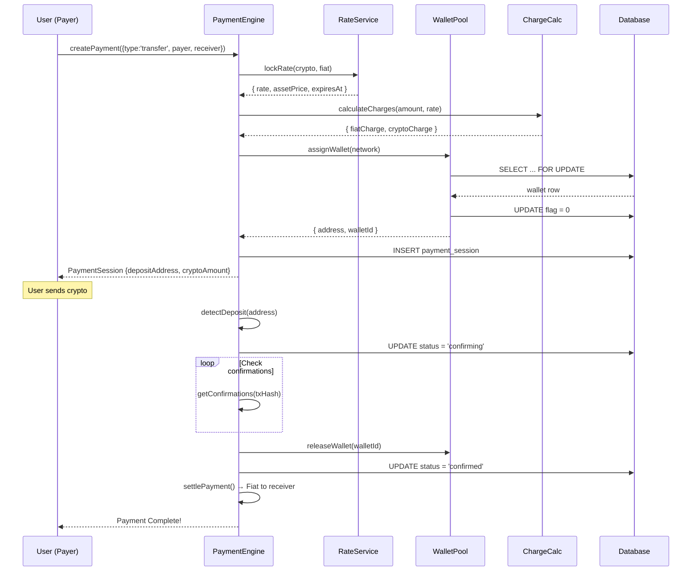
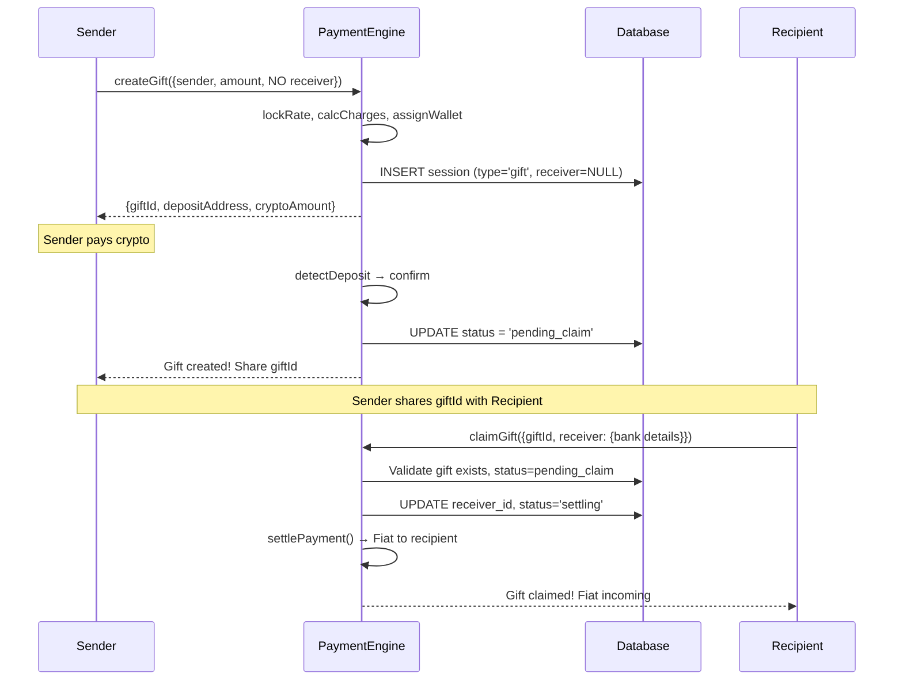
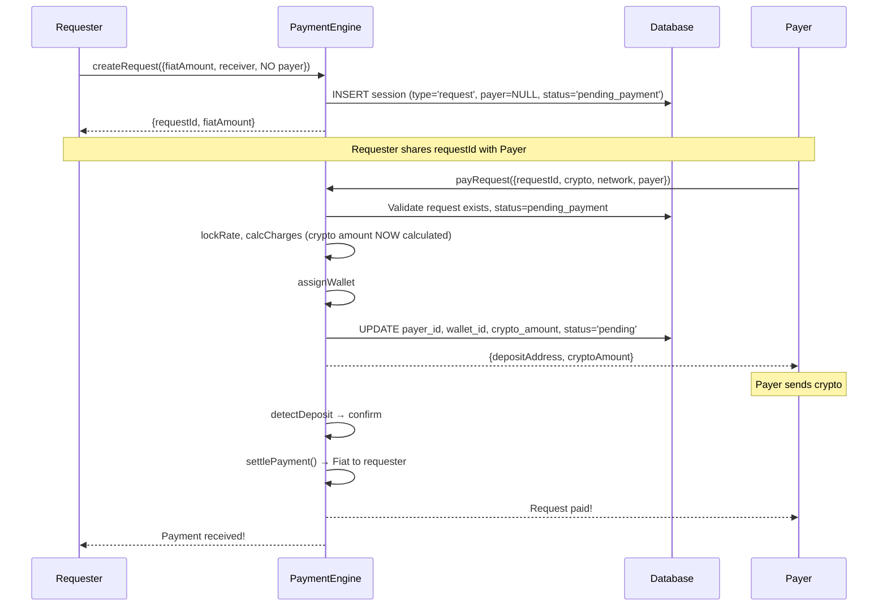
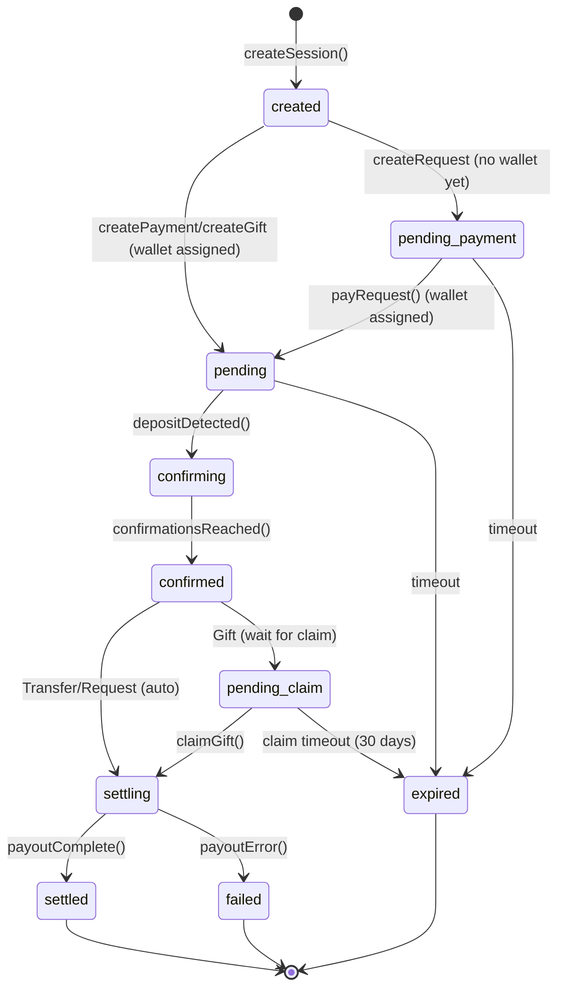
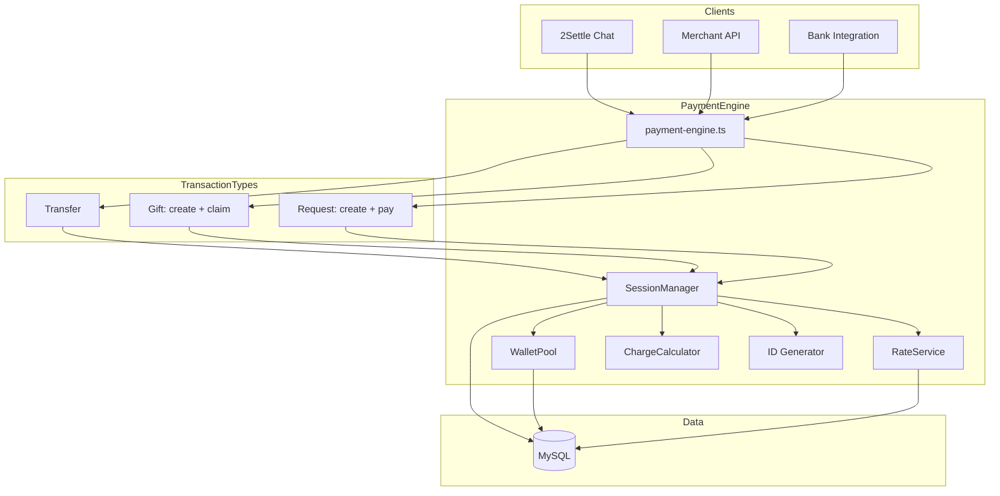

# Payment Engine Architecture

This document provides detailed diagrams of the payment engine's architecture and flows for all three transaction types: Transfer, Gift, and Request.

## Table of Contents

1. [System Architecture](#system-architecture)
2. [Component Diagram](#component-diagram)
3. [Transaction Type Flows](#transaction-type-flows)
   - [Transfer Flow](#transfer-flow)
   - [Gift Flow (Create + Claim)](#gift-flow)
   - [Request Flow (Create + Pay)](#request-flow)
4. [Session State Machine](#session-state-machine)
5. [Wallet Pool Flow](#wallet-pool-flow)
6. [Rate Locking Flow](#rate-locking-flow)
7. [Database Schema](#database-schema)
8. [Integration Points](#integration-points)

---

## System Architecture

### High-Level Overview

```
                                    ┌─────────────────────────────────────┐
                                    │           CLIENTS                    │
                                    └─────────────────────────────────────┘
                                                    │
                    ┌───────────────────────────────┼───────────────────────────────┐
                    │                               │                               │
                    ▼                               ▼                               ▼
        ┌───────────────────┐           ┌───────────────────┐           ┌───────────────────┐
        │   2Settle Chat    │           │   Merchant API    │           │  Bank/Fintech     │
        │                   │           │                   │           │   Integration     │
        │  • Chatbot UI     │           │  • REST API       │           │                   │
        │  • User wallet    │           │  • Hosted checkout│           │  • Bulk payments  │
        │  • Step machine   │           │  • JS SDK         │           │  • White-label    │
        └─────────┬─────────┘           └─────────┬─────────┘           └─────────┬─────────┘
                  │                               │                               │
                  └───────────────────────────────┼───────────────────────────────┘
                                                  │
                                                  ▼
┌─────────────────────────────────────────────────────────────────────────────────────────────┐
│                                                                                              │
│                              PAYMENT ENGINE CORE                                             │
│                                                                                              │
│  ┌──────────────────────────────────────────────────────────────────────────────────────┐  │
│  │                              PaymentEngine (Facade)                                    │  │
│  │                                                                                        │  │
│  │   TRANSFER          GIFT                      REQUEST                                  │  │
│  │   ─────────         ────────────────          ───────────────────                      │  │
│  │   createPayment()   createGift()              createRequest()                          │  │
│  │                     claimGift()               payRequest()                             │  │
│  │                                                                                        │  │
│  │   COMMON: recordDeposit() │ confirmPayment() │ settlePayment() │ getSession()         │  │
│  └──────────────────────────────────────────────────────────────────────────────────────┘  │
│                                          │                                                  │
│          ┌───────────────────────────────┼───────────────────────────────┐                 │
│          │                               │                               │                 │
│          ▼                               ▼                               ▼                 │
│  ┌───────────────┐               ┌───────────────┐               ┌───────────────┐        │
│  │    Session    │               │    Wallet     │               │     Rate      │        │
│  │    Manager    │◄─────────────▶│     Pool      │               │    Service    │        │
│  │               │               │               │               │               │        │
│  │ • Create      │               │ • Assign      │               │ • Fetch       │        │
│  │ • Update      │               │ • Release     │               │ • Lock        │        │
│  │ • Validate    │               │ • Status      │               │ • Cache       │        │
│  │ • Claim/Pay   │               │ • Expiry      │               │ • Convert     │        │
│  └───────┬───────┘               └───────────────┘               └───────────────┘        │
│          │                                                               │                 │
│          │                       ┌───────────────┐                       │                 │
│          │                       │    Charge     │◄──────────────────────┘                 │
│          │                       │   Calculator  │                                         │
│          │                       │               │                                         │
│          │                       │ • Tiered fees │                                         │
│          │                       │ • Conversion  │                                         │
│          │                       └───────────────┘                                         │
│          │                                                                                 │
│          │                       ┌───────────────┐                                         │
│          └──────────────────────▶│     Utils     │                                         │
│                                  │               │                                         │
│                                  │ • ID Gen      │                                         │
│                                  │ • Validation  │                                         │
│                                  └───────────────┘                                         │
│                                                                                             │
└─────────────────────────────────────────────────────────────────────────────────────────────┘
                                          │
                                          ▼
┌─────────────────────────────────────────────────────────────────────────────────────────────┐
│                                      DATA LAYER                                              │
│                                                                                              │
│  ┌──────────────┐  ┌──────────────┐  ┌──────────────┐  ┌──────────────┐  ┌──────────────┐  │
│  │   payment_   │  │   wallets    │  │    rates     │  │    payers    │  │  receivers   │  │
│  │   sessions   │  │              │  │              │  │              │  │              │  │
│  └──────────────┘  └──────────────┘  └──────────────┘  └──────────────┘  └──────────────┘  │
│                                                                                              │
└─────────────────────────────────────────────────────────────────────────────────────────────┘
```

---

## Component Diagram

### Module Dependencies

```
┌─────────────────────────────────────────────────────────────────┐
│                         index.ts                                 │
│                    (Public Exports)                              │
└────────────────────────────┬────────────────────────────────────┘
                             │
                             ▼
┌─────────────────────────────────────────────────────────────────┐
│                     payment-engine.ts                            │
│                    (Facade Pattern)                              │
│                                                                  │
│   TRANSFER:                                                      │
│   • createPayment(input)                                         │
│                                                                  │
│   GIFT:                                                          │
│   • createGift(input)      → Returns giftId, depositAddress      │
│   • claimGift(giftId, receiver) → Triggers settlement            │
│                                                                  │
│   REQUEST:                                                       │
│   • createRequest(input)   → Returns requestId                   │
│   • payRequest(requestId, payer, crypto) → Returns depositAddr   │
│                                                                  │
│   COMMON:                                                        │
│   • getSession(id)                                               │
│   • recordDeposit(id, txHash, amount)                            │
│   • confirmPayment(id)                                           │
│   • settlePayment(id)                                            │
└────────────────────────────┬────────────────────────────────────┘
                             │
         ┌───────────────────┼───────────────────┐
         │                   │                   │
         ▼                   ▼                   ▼
┌─────────────────┐ ┌─────────────────┐ ┌─────────────────┐
│ session/        │ │ wallet/         │ │ rate/           │
│                 │ │                 │ │                 │
│ session-manager │ │ wallet-pool.ts  │ │ rate-service.ts │
│ session-repo    │ │                 │ │                 │
└────────┬────────┘ └────────┬────────┘ └────────┬────────┘
         │                   │                   │
         │                   │                   │
         ▼                   ▼                   ▼
┌─────────────────┐ ┌─────────────────┐ ┌─────────────────┐
│ charges/        │ │ utils/          │ │ errors.ts       │
│                 │ │                 │ │                 │
│ charge-calc.ts  │ │ id-generator.ts │ │ Custom errors   │
└─────────────────┘ └─────────────────┘ └─────────────────┘
         │                   │                   │
         └───────────────────┼───────────────────┘
                             │
                             ▼
                    ┌─────────────────┐
                    │    types.ts     │
                    │                 │
                    │ All interfaces  │
                    └─────────────────┘
```

---

## Transaction Type Flows

### Transfer Flow

**Description**: User initiates payment, provides bank details upfront, pays crypto, recipient receives fiat.

**Participants**:
- **Payer**: Known at creation (provides crypto)
- **Receiver**: Known at creation (provides bank details)

```
┌──────────────┐     ┌──────────────────────────────────────────────────────────────────────┐
│              │     │                        PAYMENT ENGINE                                 │
│    USER      │     │                                                                       │
│   (Payer)    │     │  ┌────────────┐   ┌────────────┐   ┌────────────┐   ┌────────────┐  │
└──────┬───────┘     │  │ 1. CREATE  │   │ 2. DEPOSIT │   │ 3. CONFIRM │   │ 4. SETTLE  │  │
       │             │  └─────┬──────┘   └─────┬──────┘   └─────┬──────┘   └─────┬──────┘  │
       │             └────────┼────────────────┼────────────────┼────────────────┼─────────┘
       │                      │                │                │                │
       │  1. createPayment()  │                │                │                │
       │  {type: 'transfer',  │                │                │                │
       │   payer, receiver}   │                │                │                │
       │ ─────────────────────▶                │                │                │
       │                      │                │                │                │
       │                      ▼                │                │                │
       │              ┌───────────────┐        │                │                │
       │              │ Lock Rate     │        │                │                │
       │              │ Calc Charges  │        │                │                │
       │              │ Assign Wallet │        │                │                │
       │              └───────┬───────┘        │                │                │
       │                      │                │                │                │
       │  Session + Address   │                │                │                │
       │ ◀────────────────────┘                │                │                │
       │                                       │                │                │
       │  2. Send Crypto                       │                │                │
       │     to depositAddress                 │                │                │
       │ ─────────────────────────────────────▶│                │                │
       │                                       │                │                │
       │                                       ▼                │                │
       │                               ┌───────────────┐        │                │
       │                               │ Detect Deposit│        │                │
       │                               │ Verify Amount │        │                │
       │                               └───────┬───────┘        │                │
       │                                       │                │                │
       │                                       │                ▼                │
       │                                       │        ┌───────────────┐        │
       │                                       │        │ Wait for      │        │
       │                                       │        │ Confirmations │        │
       │                                       │        └───────┬───────┘        │
       │                                       │                │                │
       │                                       │                ▼                │
       │                                       │        ┌───────────────┐        │
       │                                       │        │ CONFIRMED     │        │
       │                                       │        │ Release Wallet│        │
       │                                       │        └───────┬───────┘        │
       │                                       │                │                │
       │                                       │                │                ▼
       │                                       │                │        ┌───────────────┐
       │                                       │                │        │ Payout Fiat   │
       │                                       │                │        │ to Receiver's │
       │                                       │                │        │ Bank Account  │
       │                                       │                │        └───────┬───────┘
       │                                       │                │                │
       │  3. Payment Complete!                 │                │                │
       │ ◀───────────────────────────────────────────────────────────────────────┘
       │
       ▼
```

**Status Flow**: `created → pending → confirming → confirmed → settling → settled`

---

### Gift Flow

**Description**: Two-phase transaction. Sender creates gift and pays crypto. Recipient claims gift later by providing bank details.

**Participants**:
- **Sender (Payer)**: Known at creation (provides crypto)
- **Receiver**: Unknown at creation, known at claim (provides bank details)

#### Phase 1: Create Gift

```
┌──────────────┐     ┌──────────────────────────────────────────────────────────────────────┐
│              │     │                        PAYMENT ENGINE                                 │
│   SENDER     │     │                                                                       │
│              │     │  ┌────────────┐   ┌────────────┐   ┌────────────┐   ┌──────────────┐│
└──────┬───────┘     │  │ 1. CREATE  │   │ 2. DEPOSIT │   │ 3. CONFIRM │   │4. WAIT CLAIM ││
       │             │  └─────┬──────┘   └─────┬──────┘   └─────┬──────┘   └──────┬───────┘│
       │             └────────┼────────────────┼────────────────┼──────────────────┼────────┘
       │                      │                │                │                  │
       │  1. createGift()     │                │                │                  │
       │  {sender, amount,    │                │                │                  │
       │   NO receiver}       │                │                │                  │
       │ ─────────────────────▶                │                │                  │
       │                      │                │                │                  │
       │                      ▼                │                │                  │
       │              ┌───────────────┐        │                │                  │
       │              │ Lock Rate     │        │                │                  │
       │              │ Calc Charges  │        │                │                  │
       │              │ Assign Wallet │        │                │                  │
       │              │ Generate      │        │                │                  │
       │              │ Gift ID       │        │                │                  │
       │              └───────┬───────┘        │                │                  │
       │                      │                │                │                  │
       │  Session + giftId    │                │                │                  │
       │  + depositAddress    │                │                │                  │
       │ ◀────────────────────┘                │                │                  │
       │                                       │                │                  │
       │  2. Send Crypto                       │                │                  │
       │ ─────────────────────────────────────▶│                │                  │
       │                                       │                │                  │
       │                                       ▼                │                  │
       │                               ┌───────────────┐        │                  │
       │                               │ Detect Deposit│        │                  │
       │                               └───────┬───────┘        │                  │
       │                                       │                ▼                  │
       │                                       │        ┌───────────────┐          │
       │                                       │        │ Wait for      │          │
       │                                       │        │ Confirmations │          │
       │                                       │        └───────┬───────┘          │
       │                                       │                │                  │
       │                                       │                ▼                  ▼
       │                                       │        ┌───────────────┐  ┌───────────────┐
       │                                       │        │ CONFIRMED     │─▶│ PENDING_CLAIM │
       │                                       │        │ Release Wallet│  │               │
       │                                       │        └───────────────┘  │ Waiting for   │
       │                                       │                           │ recipient to  │
       │  3. Gift Created!                     │                           │ claim with    │
       │     Share giftId with recipient       │                           │ bank details  │
       │ ◀─────────────────────────────────────┼───────────────────────────│               │
       │                                       │                           └───────────────┘
       ▼
```

#### Phase 2: Claim Gift

```
┌──────────────┐     ┌──────────────────────────────────────────────────────────────────────┐
│              │     │                        PAYMENT ENGINE                                 │
│  RECIPIENT   │     │                                                                       │
│              │     │  ┌──────────────┐                            ┌────────────┐          │
└──────┬───────┘     │  │PENDING_CLAIM │                            │  SETTLE    │          │
       │             │  └──────┬───────┘                            └─────┬──────┘          │
       │             └─────────┼──────────────────────────────────────────┼─────────────────┘
       │                       │                                          │
       │  1. claimGift()       │                                          │
       │  {giftId,             │                                          │
       │   receiver: {         │                                          │
       │     bankCode,         │                                          │
       │     accountNumber,    │                                          │
       │     accountName       │                                          │
       │   }}                  │                                          │
       │ ──────────────────────▶                                          │
       │                       │                                          │
       │                       ▼                                          │
       │               ┌───────────────┐                                  │
       │               │ Validate Gift │                                  │
       │               │ - Exists?     │                                  │
       │               │ - Status ok?  │                                  │
       │               │ - Not expired?│                                  │
       │               └───────┬───────┘                                  │
       │                       │                                          │
       │                       ▼                                          │
       │               ┌───────────────┐                                  │
       │               │ Update Session│                                  │
       │               │ with receiver │                                  │
       │               │ bank details  │                                  │
       │               └───────┬───────┘                                  │
       │                       │                                          │
       │                       │                                          ▼
       │                       │                                  ┌───────────────┐
       │                       │                                  │ Payout Fiat   │
       │                       │                                  │ to Receiver's │
       │                       │                                  │ Bank Account  │
       │                       │                                  └───────┬───────┘
       │                       │                                          │
       │  2. Gift Claimed!     │                                          │
       │     Fiat incoming     │                                          │
       │ ◀────────────────────────────────────────────────────────────────┘
       │
       ▼
```

**Status Flow**: `created → pending → confirming → confirmed → pending_claim → settling → settled`

---

### Request Flow

**Description**: Two-phase transaction. User creates a payment request specifying fiat amount and bank details. Payer later fulfills the request by paying crypto.

**Participants**:
- **Requester (Receiver)**: Known at creation (provides bank details, specifies amount)
- **Payer**: Unknown at creation, known when paying

#### Phase 1: Create Request

```
┌──────────────┐     ┌──────────────────────────────────────────────────────────────────────┐
│              │     │                        PAYMENT ENGINE                                 │
│  REQUESTER   │     │                                                                       │
│              │     │  ┌────────────┐                              ┌─────────────────┐     │
└──────┬───────┘     │  │ 1. CREATE  │                              │ PENDING_PAYMENT │     │
       │             │  └─────┬──────┘                              └────────┬────────┘     │
       │             └────────┼───────────────────────────────────────────────┼─────────────┘
       │                      │                                               │
       │  1. createRequest()  │                                               │
       │  {fiatAmount,        │                                               │
       │   receiver: {        │                                               │
       │     bankCode,        │                                               │
       │     accountNumber,   │                                               │
       │     accountName      │                                               │
       │   },                 │                                               │
       │   NO payer}          │                                               │
       │ ─────────────────────▶                                               │
       │                      │                                               │
       │                      ▼                                               │
       │              ┌───────────────┐                                       │
       │              │ Validate      │                                       │
       │              │ receiver bank │                                       │
       │              │ Generate      │                                       │
       │              │ Request ID    │                                       │
       │              └───────┬───────┘                                       │
       │                      │                                               │
       │                      │  Note: NO wallet assigned yet                 │
       │                      │  NO rate locked yet                           │
       │                      │  (happens when payer pays)                    │
       │                      │                                               │
       │                      └───────────────────────────────────────────────▶
       │                                                                      │
       │  Request Created!                                            ┌───────────────┐
       │  {requestId, fiatAmount}                                     │PENDING_PAYMENT│
       │ ◀────────────────────────────────────────────────────────────│               │
       │                                                              │ Waiting for   │
       │  Share requestId with payer                                  │ someone to    │
       │                                                              │ pay           │
       ▼                                                              └───────────────┘
```

#### Phase 2: Pay Request

```
┌──────────────┐     ┌──────────────────────────────────────────────────────────────────────┐
│              │     │                        PAYMENT ENGINE                                 │
│    PAYER     │     │                                                                       │
│              │     │  ┌─────────────────┐  ┌─────────┐  ┌────────────┐  ┌──────────────┐ │
└──────┬───────┘     │  │ PENDING_PAYMENT │  │ PENDING │  │ CONFIRMING │  │   SETTLE     │ │
       │             │  └────────┬────────┘  └────┬────┘  └─────┬──────┘  └──────┬───────┘ │
       │             └───────────┼────────────────┼─────────────┼─────────────────┼─────────┘
       │                         │                │             │                 │
       │  1. payRequest()        │                │             │                 │
       │  {requestId,            │                │             │                 │
       │   crypto: 'BTC',        │                │             │                 │
       │   network: 'bitcoin',   │                │             │                 │
       │   payer: {...}}         │                │             │                 │
       │ ────────────────────────▶                │             │                 │
       │                         │                │             │                 │
       │                         ▼                │             │                 │
       │                 ┌───────────────┐        │             │                 │
       │                 │ Validate Req  │        │             │                 │
       │                 │ - Exists?     │        │             │                 │
       │                 │ - Not expired?│        │             │                 │
       │                 │ - Not paid?   │        │             │                 │
       │                 └───────┬───────┘        │             │                 │
       │                         │                │             │                 │
       │                         ▼                │             │                 │
       │                 ┌───────────────┐        │             │                 │
       │                 │ NOW:          │        │             │                 │
       │                 │ • Lock Rate   │        │             │                 │
       │                 │ • Calc Crypto │        │             │                 │
       │                 │ • Assign Wallet│       │             │                 │
       │                 │ • Update payer│        │             │                 │
       │                 └───────┬───────┘        │             │                 │
       │                         │                │             │                 │
       │                         └────────────────▶             │                 │
       │                                          │             │                 │
       │  Session + depositAddress                │             │                 │
       │  + cryptoAmount                          │             │                 │
       │ ◀────────────────────────────────────────┘             │                 │
       │                                                        │                 │
       │  2. Send Crypto                                        │                 │
       │ ──────────────────────────────────────────────────────▶│                 │
       │                                                        │                 │
       │                                                        ▼                 │
       │                                                ┌───────────────┐         │
       │                                                │ Confirmations │         │
       │                                                └───────┬───────┘         │
       │                                                        │                 │
       │                                                        │                 ▼
       │                                                        │         ┌───────────────┐
       │                                                        │         │ Payout Fiat   │
       │                                                        │         │ to Requester's│
       │                                                        │         │ Bank Account  │
       │                                                        │         └───────┬───────┘
       │                                                        │                 │
       │  3. Request Paid!                                      │                 │
       │ ◀────────────────────────────────────────────────────────────────────────┘
       │
       ▼
```

**Status Flow**: `created → pending_payment → pending → confirming → confirmed → settling → settled`

---

## Session State Machine

### Combined State Machine (All Transaction Types)

```
                                    ┌─────────────────┐
                                    │                 │
                        ┌───────────│     START       │
                        │           │                 │
                        │           └─────────────────┘
                        │
                        ▼
                ┌───────────────┐
                │               │
                │    CREATED    │─────────────────────────────────────────────┐
                │               │                                             │
                └───────┬───────┘                                             │
                        │                                                     │
        ┌───────────────┼───────────────┐                                     │
        │               │               │                                     │
        │ (transfer/    │ (request)     │                                     │
        │  gift)        │               │                                     │
        ▼               ▼               │                                     │
┌───────────────┐ ┌─────────────────┐   │                                     │
│               │ │                 │   │                                     │
│    PENDING    │ │ PENDING_PAYMENT │───┼─────────────────────────────────────┤
│               │ │                 │   │                                     │
│  (wallet      │ │ (waiting for    │   │                                     │
│   assigned,   │ │  payer to       │   │                                     │
│   waiting     │ │  call           │   │                             timeout │
│   for crypto) │ │  payRequest())  │   │                                     │
└───────┬───────┘ └────────┬────────┘   │                                     │
        │                  │            │                                     │
        │                  │ payRequest()                                     │
        │                  │            │                                     │
        │                  └────────────┼──────────┐                          │
        │                               │          │                          │
        │ detectDeposit()               │          ▼                          │
        │                               │  ┌───────────────┐                  │
        ▼                               │  │               │                  │
┌───────────────┐                       │  │    PENDING    │                  │
│               │                       │  │               │                  │
│  CONFIRMING   │◀──────────────────────┼──┤  (now wallet  │                  │
│               │                       │  │   assigned)   │                  │
└───────┬───────┘                       │  └───────────────┘                  │
        │                               │                                     │
        │ confirmations >= required     │                                     │
        │                               │                                     │
        ▼                               │                                     │
┌───────────────┐                       │                                     │
│               │                       │                                     │
│   CONFIRMED   │                       │                                     │
│               │                       │                                     │
└───────┬───────┘                       │                                     │
        │                               │                                     │
        ├───────────────┐               │                                     │
        │               │               │                                     │
        │ (transfer/    │ (gift)        │                                     │
        │  request)     │               │                                     │
        ▼               ▼               │                                     │
┌───────────────┐ ┌─────────────────┐   │                                     │
│               │ │                 │   │                                     │
│   SETTLING    │ │ PENDING_CLAIM   │───┼─────────────────────────────────────┤
│               │ │                 │   │                                     │
│               │ │ (waiting for    │   │                             timeout │
│               │ │  recipient to   │   │                                     │
│               │ │  claimGift())   │   │                                     │
└───────┬───────┘ └────────┬────────┘   │                                     │
        │                  │            │                                     │
        │                  │ claimGift()│                                     │
        │                  │            │                                     │
        │                  └────────────┼──────────┐                          │
        │                               │          │                          │
        │ payoutComplete()              │          ▼                          │
        │                               │  ┌───────────────┐                  │
        ▼                               │  │               │                  │
┌───────────────┐                       │  │   SETTLING    │                  │
│               │                       │  │               │                  │
│    SETTLED    │◀──────────────────────┼──┤               │                  │
│               │                       │  └───────────────┘                  │
└───────────────┘                       │                                     │
                                        │                                     │
                                        │                                     ▼
                                        │                             ┌───────────────┐
                                        │                             │               │
                                        │                             │    EXPIRED    │
                                        │                             │               │
                                        │                             └───────────────┘
                                        │
                                        │  payoutFailed()
                                        │
                                        ▼
                                ┌───────────────┐
                                │               │
                                │    FAILED     │
                                │               │
                                └───────────────┘
```

### Transition Table by Type

| Type | From | To | Trigger | Actions |
|------|------|----|---------|---------|
| ALL | - | `created` | `createSession()` | Generate ID |
| **Transfer** | `created` | `pending` | `createPayment()` | Lock rate, calc charges, assign wallet |
| **Gift** | `created` | `pending` | `createGift()` | Lock rate, calc charges, assign wallet |
| **Request** | `created` | `pending_payment` | `createRequest()` | Validate receiver bank, NO wallet yet |
| **Request** | `pending_payment` | `pending` | `payRequest()` | Lock rate, calc charges, assign wallet |
| ALL | `pending` | `confirming` | Deposit detected | Record tx hash |
| ALL | `pending` | `expired` | Timeout | Release wallet |
| ALL | `confirming` | `confirmed` | Confirmations met | Release wallet |
| **Transfer/Request** | `confirmed` | `settling` | Auto-trigger | Initiate fiat payout |
| **Gift** | `confirmed` | `pending_claim` | Auto-trigger | Wait for claim |
| **Gift** | `pending_claim` | `settling` | `claimGift()` | Add receiver, initiate payout |
| **Gift** | `pending_claim` | `expired` | Timeout (30 days) | Mark expired |
| ALL | `settling` | `settled` | Payout confirmed | Complete |
| ALL | `settling` | `failed` | Payout error | Log error |

---

## Wallet Pool Flow

### When Wallet is Assigned (by Transaction Type)

```
┌─────────────────────────────────────────────────────────────────────────────┐
│                        WALLET ASSIGNMENT TIMING                              │
│                                                                              │
│   TRANSFER:                                                                  │
│   ┌──────────────┐                                                           │
│   │ createPayment│──▶ Wallet assigned IMMEDIATELY                           │
│   └──────────────┘    (payer and receiver both known)                        │
│                                                                              │
│   GIFT:                                                                      │
│   ┌──────────────┐                                                           │
│   │  createGift  │──▶ Wallet assigned IMMEDIATELY                           │
│   └──────────────┘    (sender pays now, receiver claims later)              │
│                                                                              │
│   REQUEST:                                                                   │
│   ┌──────────────┐                                                           │
│   │createRequest │──▶ NO wallet assigned                                     │
│   └──────────────┘    (just creates the request, stores receiver info)       │
│          │                                                                   │
│          │ (later, when payer calls payRequest)                              │
│          ▼                                                                   │
│   ┌──────────────┐                                                           │
│   │  payRequest  │──▶ Wallet assigned NOW                                    │
│   └──────────────┘    (rate locked, crypto amount calculated)               │
│                                                                              │
└─────────────────────────────────────────────────────────────────────────────┘
```

### Wallet Assignment (with Concurrency Control)

```
┌─────────────────┐     ┌─────────────────┐     ┌─────────────────┐
│   Payment A     │     │   Payment B     │     │   Payment C     │
└────────┬────────┘     └────────┬────────┘     └────────┬────────┘
         │                       │                       │
         │ assignWallet()        │ assignWallet()        │ assignWallet()
         │                       │                       │
         ▼                       ▼                       ▼
┌─────────────────────────────────────────────────────────────────────┐
│                          WALLET POOL                                 │
│                                                                      │
│  ┌──────────────────────────────────────────────────────────────┐   │
│  │                    MySQL Transaction                          │   │
│  │                                                               │   │
│  │   BEGIN TRANSACTION;                                          │   │
│  │                                                               │   │
│  │   SELECT * FROM wallets                                       │   │
│  │   WHERE bep20_flag = 1                                        │   │
│  │   LIMIT 1                                                     │   │
│  │   FOR UPDATE;  ◀──── Row lock prevents race condition         │   │
│  │                                                               │   │
│  │   UPDATE wallets                                              │   │
│  │   SET bep20_flag = 0,                                         │   │
│  │       bep20_last_assigned = NOW()                             │   │
│  │   WHERE id = ?;                                               │   │
│  │                                                               │   │
│  │   COMMIT;                                                     │   │
│  └──────────────────────────────────────────────────────────────┘   │
│                                                                      │
│  ┌─────────┐  ┌─────────┐  ┌─────────┐  ┌─────────┐  ┌─────────┐   │
│  │Wallet 1 │  │Wallet 2 │  │Wallet 3 │  │Wallet 4 │  │Wallet 5 │   │
│  │         │  │         │  │         │  │         │  │         │   │
│  │ BTC: ✓  │  │ BTC: ✓  │  │ BTC: ✗  │  │ BTC: ✓  │  │ BTC: ✓  │   │
│  │ ETH: ✓  │  │ ETH: ✗  │  │ ETH: ✓  │  │ ETH: ✓  │  │ ETH: ✓  │   │
│  │ BSC: ✓  │  │ BSC: ✓  │  │ BSC: ✓  │  │ BSC: ✗  │  │ BSC: ✓  │   │
│  │ TRX: ✓  │  │ TRX: ✓  │  │ TRX: ✓  │  │ TRX: ✓  │  │ TRX: ✓  │   │
│  └─────────┘  └─────────┘  └─────────┘  └─────────┘  └─────────┘   │
│                                                                      │
│  ✓ = Available (flag = 1)                                           │
│  ✗ = In Use (flag = 0)                                              │
│                                                                      │
└─────────────────────────────────────────────────────────────────────┘
```

### Wallet Release Timing

| Transaction Type | When Wallet is Released |
|------------------|------------------------|
| **Transfer** | After crypto deposit is confirmed (`confirmed` status) |
| **Gift** | After crypto deposit is confirmed (before `pending_claim`) |
| **Request** | After crypto deposit is confirmed (`confirmed` status) |
| **Expired** | When session expires without deposit |

---

## Rate Locking Flow

### When Rate is Locked (by Transaction Type)

```
┌─────────────────────────────────────────────────────────────────────────────┐
│                          RATE LOCKING TIMING                                 │
│                                                                              │
│   TRANSFER:                                                                  │
│   ┌──────────────┐                                                           │
│   │ createPayment│──▶ Rate locked IMMEDIATELY                               │
│   └──────────────┘    (fiat amount known, crypto calculated)                 │
│                                                                              │
│   GIFT:                                                                      │
│   ┌──────────────┐                                                           │
│   │  createGift  │──▶ Rate locked IMMEDIATELY                               │
│   └──────────────┘    (fiat amount known, crypto calculated)                 │
│                                                                              │
│   REQUEST:                                                                   │
│   ┌──────────────┐                                                           │
│   │createRequest │──▶ NO rate locked                                         │
│   └──────────────┘    (fiat amount stored, but no crypto yet)                │
│          │                                                                   │
│          │ (later, when payer calls payRequest with crypto choice)          │
│          ▼                                                                   │
│   ┌──────────────┐                                                           │
│   │  payRequest  │──▶ Rate locked NOW                                        │
│   └──────────────┘    (crypto/network chosen, rate locked, amount calc'd)   │
│                                                                              │
└─────────────────────────────────────────────────────────────────────────────┘
```

### Rate Service Architecture

```
┌─────────────────────────────────────────────────────────────────────┐
│                         RATE SERVICE                                 │
│                                                                      │
│   ┌───────────────────────────────────────────────────────────┐     │
│   │                    In-Memory Cache                         │     │
│   │                    (60 second TTL)                         │     │
│   │                                                            │     │
│   │   ┌─────────────┐  ┌─────────────┐  ┌─────────────┐       │     │
│   │   │ BTC: $97500 │  │ ETH: $2750  │  │ BNB: $620   │       │     │
│   │   │ cached: 45s │  │ cached: 45s │  │ cached: 45s │       │     │
│   │   └─────────────┘  └─────────────┘  └─────────────┘       │     │
│   │                                                            │     │
│   └───────────────────────────────────────────────────────────┘     │
│                              │                                       │
│                              │ cache miss?                           │
│                              ▼                                       │
│   ┌───────────────────────────────────────────────────────────┐     │
│   │                    External APIs                           │     │
│   │                                                            │     │
│   │   ┌─────────────────┐         ┌─────────────────┐         │     │
│   │   │  Database       │         │  CoinMarketCap  │         │     │
│   │   │  (rates table)  │         │  API            │         │     │
│   │   │                 │         │                 │         │     │
│   │   │  merchant_rate  │         │  asset prices   │         │     │
│   │   │  (NGN/USD)      │         │  (USD)          │         │     │
│   │   └─────────────────┘         └─────────────────┘         │     │
│   │                                                            │     │
│   └───────────────────────────────────────────────────────────┘     │
│                                                                      │
└─────────────────────────────────────────────────────────────────────┘

                              │
                              │ lockRate(crypto, fiat, ttl)
                              ▼

┌─────────────────────────────────────────────────────────────────────┐
│                          RATE LOCK                                   │
│                                                                      │
│   {                                                                  │
│     rate: 1600,           // NGN per USD                            │
│     assetPrice: 97500,    // USD per BTC                            │
│     lockedAt: "2026-02-17T10:00:00Z",                               │
│     expiresAt: "2026-02-17T10:30:00Z"   // 30 min validity          │
│   }                                                                  │
│                                                                      │
│   Crypto Amount = (fiatAmount + charges) / rate / assetPrice        │
│                 = (50000 + 500) / 1600 / 97500                       │
│                 = 0.000324 BTC                                       │
│                                                                      │
└─────────────────────────────────────────────────────────────────────┘
```

---

## Database Schema

### Entity Relationship Diagram

```
┌─────────────────────────────────────────────────────────────────────────────────┐
│                                                                                  │
│   ┌───────────────┐           ┌─────────────────────┐         ┌──────────────┐ │
│   │    payers     │           │   payment_sessions  │         │  receivers   │ │
│   ├───────────────┤           ├─────────────────────┤         ├──────────────┤ │
│   │ id (PK)       │◀─────────┐│ id (PK)             │┌───────▶│ id (PK)      │ │
│   │ chat_id       │          ││ payment_id          ││        │ bank_code    │ │
│   │ phone         │          ││ reference           ││        │ bank_account │ │
│   │ wallet        │          ││                     ││        │ account_name │ │
│   │ name          │          ││ type (transfer/     ││        │ phone        │ │
│   └───────────────┘          ││       gift/request) ││        └──────────────┘ │
│                              ││ status              ││                         │
│                              ││                     ││                         │
│   ┌───────────────┐          ││ fiat_amount         ││                         │
│   │    wallets    │          ││ fiat_currency       ││                         │
│   ├───────────────┤          ││ crypto_amount       ││                         │
│   │ id (PK)       │◀────────┐││ crypto_asset        ││                         │
│   │ bitcoin       │         │││ network             ││                         │
│   │ evm           │         │││                     ││                         │
│   │ tron          │         │││ exchange_rate       ││                         │
│   │ bitcoin_flag  │         │││ asset_price         ││                         │
│   │ ethereum_flag │         │││ rate_locked_at      ││                         │
│   │ binance_flag  │         │││ rate_expires_at     ││                         │
│   │ tron_flag     │         │││                     ││                         │
│   │ erc20_flag    │         │││ fiat_charge         ││                         │
│   │ bep20_flag    │         │││ crypto_charge       ││                         │
│   │ trc20_flag    │         │││                     ││                         │
│   │ *_last_assigned│         ││├─────────────────────┤│                         │
│   └───────────────┘         ││ wallet_id (FK)───────┘│                         │
│                             ││ deposit_address       │                         │
│                             ││ payer_id (FK)─────────┘                         │
│   ┌───────────────┐         ││ receiver_id (FK)──────┘ (NULL for gift create) │
│   │     rates     │         ││                        │                         │
│   ├───────────────┤         ││ gift_id (for gifts)   │                         │
│   │ id (PK)       │         ││ request_id (for reqs) │                         │
│   │ current_rate  │─────────▶│ gift_message          │                         │
│   │ merchant_rate │         │ gift_sender_name      │                         │
│   │ profit_rate   │         │ gift_claimed_at       │                         │
│   │ update_at     │         │ gift_claim_expires_at │                         │
│   └───────────────┘         │                        │                         │
│                             │ deposit_tx_hash       │                         │
│                             │ deposit_amount        │                         │
│                             │ deposit_confirmed_at  │                         │
│                             │                        │                         │
│                             │ created_at            │                         │
│                             │ updated_at            │                         │
│                             │ expires_at            │                         │
│                             │ settled_at            │                         │
│                             └────────────────────────┘                         │
│                                                                                  │
└─────────────────────────────────────────────────────────────────────────────────┘
```

### Key Schema Differences by Type

| Field | Transfer | Gift | Request |
|-------|----------|------|---------|
| `payer_id` | Set at creation | Set at creation | Set at `payRequest()` |
| `receiver_id` | Set at creation | Set at `claimGift()` | Set at creation |
| `wallet_id` | Set at creation | Set at creation | Set at `payRequest()` |
| `exchange_rate` | Locked at creation | Locked at creation | Locked at `payRequest()` |
| `crypto_amount` | Calculated at creation | Calculated at creation | Calculated at `payRequest()` |
| `gift_id` | NULL | Generated | NULL |
| `request_id` | NULL | NULL | Generated |
| `gift_claim_expires_at` | NULL | Set (30 days) | NULL |

---

## Integration Points

### How Different Clients Use the Engine

```
┌─────────────────────────────────────────────────────────────────────────────┐
│                                                                              │
│  ┌─────────────────────────────────────────────────────────────────────┐    │
│  │                        2SETTLE CHAT (Existing)                       │    │
│  │                                                                      │    │
│  │   TRANSFER:                                                          │    │
│  │   User ──▶ Chatbot ──▶ Handler ──▶ PaymentEngine.createPayment()    │    │
│  │                                                                      │    │
│  │   GIFT:                                                              │    │
│  │   Sender ──▶ Chatbot ──▶ Handler ──▶ PaymentEngine.createGift()     │    │
│  │   Recipient ──▶ Chatbot ──▶ Handler ──▶ PaymentEngine.claimGift()   │    │
│  │                                                                      │    │
│  │   REQUEST:                                                           │    │
│  │   Requester ──▶ Chatbot ──▶ Handler ──▶ PaymentEngine.createRequest()│   │
│  │   Payer ──▶ Chatbot ──▶ Handler ──▶ PaymentEngine.payRequest()      │    │
│  │                                                                      │    │
│  └─────────────────────────────────────────────────────────────────────┘    │
│                                                                              │
│  ┌─────────────────────────────────────────────────────────────────────┐    │
│  │                        MERCHANT API (New)                            │    │
│  │                                                                      │    │
│  │   Merchant ──▶ POST /api/v1/payments ──▶ PaymentEngine.create()     │    │
│  │                                                                      │    │
│  │   Features:                                                          │    │
│  │   • REST API with API keys                                           │    │
│  │   • Hosted checkout page                                             │    │
│  │   • Webhook notifications                                            │    │
│  │   • JS SDK for inline integration                                    │    │
│  │                                                                      │    │
│  └─────────────────────────────────────────────────────────────────────┘    │
│                                                                              │
│  ┌─────────────────────────────────────────────────────────────────────┐    │
│  │                     BANK/FINTECH INTEGRATION (Future)                │    │
│  │                                                                      │    │
│  │   Bank System ──▶ Bulk API ──▶ PaymentEngine.createBatch()          │    │
│  │                                                                      │    │
│  │   Features:                                                          │    │
│  │   • White-label checkout                                             │    │
│  │   • Bulk payment processing                                          │    │
│  │   • Custom settlement schedules                                      │    │
│  │   • Dedicated support                                                │    │
│  │                                                                      │    │
│  └─────────────────────────────────────────────────────────────────────┘    │
│                                                                              │
└─────────────────────────────────────────────────────────────────────────────┘
```

---

## Mermaid Diagrams

### Transfer Flow (Mermaid)



### Gift Flow (Mermaid)



### Request Flow (Mermaid)



### State Machine (Mermaid)



### Component Diagram (Mermaid)


