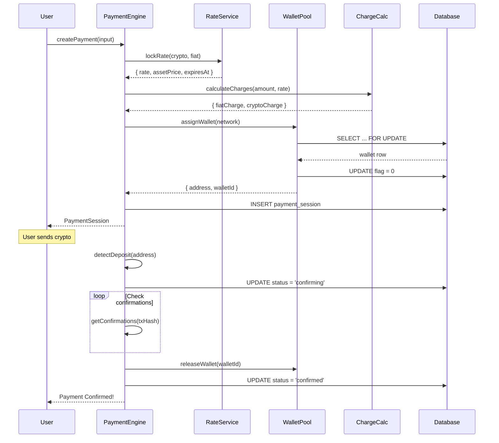
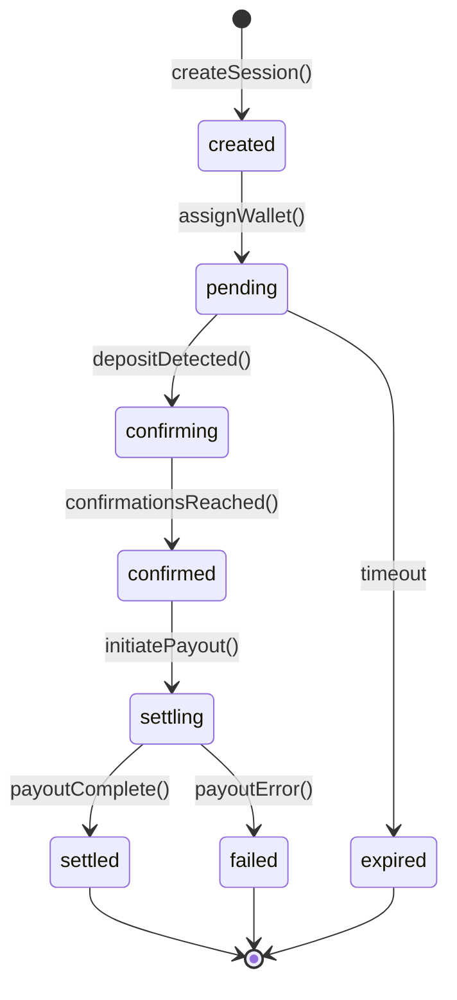
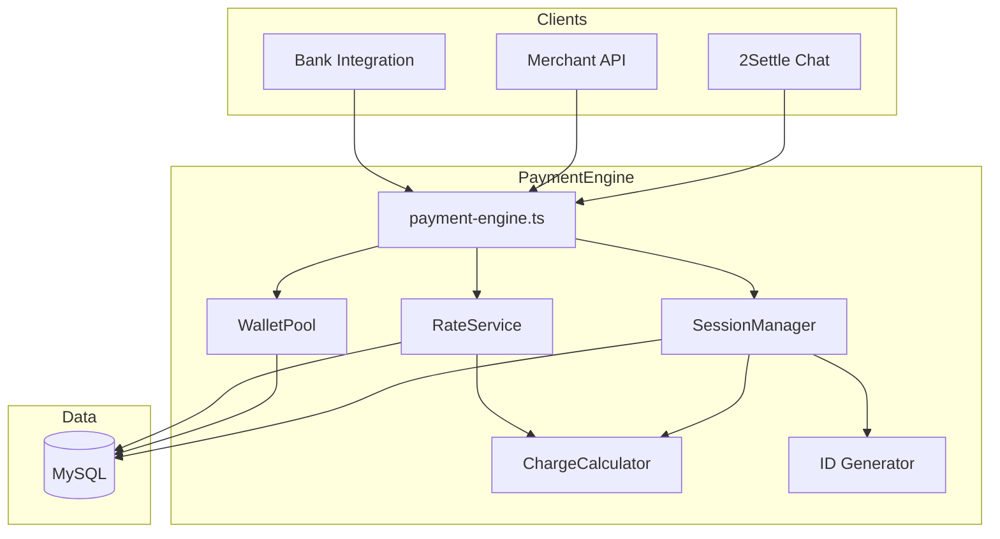

# Payment Engine Architecture

This document provides detailed diagrams of the payment engine's architecture and flows.

## Table of Contents

1. [System Architecture](#system-architecture)
2. [Component Diagram](#component-diagram)
3. [Payment Flow](#payment-flow)
4. [Session State Machine](#session-state-machine)
5. [Wallet Pool Flow](#wallet-pool-flow)
6. [Rate Locking Flow](#rate-locking-flow)
7. [Database Schema](#database-schema)
8. [Integration Points](#integration-points)

---

## System Architecture

### High-Level Overview

```
                                    ┌─────────────────────────────────────┐
                                    │           CLIENTS                    │
                                    └─────────────────────────────────────┘
                                                    │
                    ┌───────────────────────────────┼───────────────────────────────┐
                    │                               │                               │
                    ▼                               ▼                               ▼
        ┌───────────────────┐           ┌───────────────────┐           ┌───────────────────┐
        │   2Settle Chat    │           │   Merchant API    │           │  Bank/Fintech     │
        │                   │           │                   │           │   Integration     │
        │  • Chatbot UI     │           │  • REST API       │           │                   │
        │  • User wallet    │           │  • Hosted checkout│           │  • Bulk payments  │
        │  • Step machine   │           │  • JS SDK         │           │  • White-label    │
        └─────────┬─────────┘           └─────────┬─────────┘           └─────────┬─────────┘
                  │                               │                               │
                  └───────────────────────────────┼───────────────────────────────┘
                                                  │
                                                  ▼
┌─────────────────────────────────────────────────────────────────────────────────────────────┐
│                                                                                              │
│                              PAYMENT ENGINE CORE                                             │
│                                                                                              │
│  ┌──────────────────────────────────────────────────────────────────────────────────────┐  │
│  │                              PaymentEngine (Facade)                                    │  │
│  │                                                                                        │  │
│  │   createPayment()  │  recordDeposit()  │  confirmPayment()  │  settlePayment()        │  │
│  └──────────────────────────────────────────────────────────────────────────────────────┘  │
│                                          │                                                  │
│          ┌───────────────────────────────┼───────────────────────────────┐                 │
│          │                               │                               │                 │
│          ▼                               ▼                               ▼                 │
│  ┌───────────────┐               ┌───────────────┐               ┌───────────────┐        │
│  │    Session    │               │    Wallet     │               │     Rate      │        │
│  │    Manager    │◄─────────────▶│     Pool      │               │    Service    │        │
│  │               │               │               │               │               │        │
│  │ • Create      │               │ • Assign      │               │ • Fetch       │        │
│  │ • Update      │               │ • Release     │               │ • Lock        │        │
│  │ • Validate    │               │ • Status      │               │ • Cache       │        │
│  └───────┬───────┘               └───────────────┘               └───────────────┘        │
│          │                                                               │                 │
│          │                       ┌───────────────┐                       │                 │
│          │                       │    Charge     │◄──────────────────────┘                 │
│          │                       │   Calculator  │                                         │
│          │                       │               │                                         │
│          │                       │ • Tiered fees │                                         │
│          │                       │ • Conversion  │                                         │
│          │                       └───────────────┘                                         │
│          │                                                                                 │
│          │                       ┌───────────────┐                                         │
│          └──────────────────────▶│     Utils     │                                         │
│                                  │               │                                         │
│                                  │ • ID Gen      │                                         │
│                                  │ • Validation  │                                         │
│                                  └───────────────┘                                         │
│                                                                                             │
└─────────────────────────────────────────────────────────────────────────────────────────────┘
                                          │
                                          ▼
┌─────────────────────────────────────────────────────────────────────────────────────────────┐
│                                      DATA LAYER                                              │
│                                                                                              │
│  ┌──────────────┐  ┌──────────────┐  ┌──────────────┐  ┌──────────────┐  ┌──────────────┐  │
│  │   payment_   │  │   wallets    │  │    rates     │  │    payers    │  │  receivers   │  │
│  │   sessions   │  │              │  │              │  │              │  │              │  │
│  └──────────────┘  └──────────────┘  └──────────────┘  └──────────────┘  └──────────────┘  │
│                                                                                              │
└─────────────────────────────────────────────────────────────────────────────────────────────┘
```

---

## Component Diagram

### Module Dependencies

```
┌─────────────────────────────────────────────────────────────────┐
│                         index.ts                                 │
│                    (Public Exports)                              │
└────────────────────────────┬────────────────────────────────────┘
                             │
                             ▼
┌─────────────────────────────────────────────────────────────────┐
│                     payment-engine.ts                            │
│                    (Facade Pattern)                              │
│                                                                  │
│   Provides clean API:                                            │
│   • createPayment(input)                                         │
│   • getSession(id)                                               │
│   • recordDeposit(id, txHash, amount)                            │
│   • confirmPayment(id)                                           │
│   • settlePayment(id)                                            │
└────────────────────────────┬────────────────────────────────────┘
                             │
         ┌───────────────────┼───────────────────┐
         │                   │                   │
         ▼                   ▼                   ▼
┌─────────────────┐ ┌─────────────────┐ ┌─────────────────┐
│ session/        │ │ wallet/         │ │ rate/           │
│                 │ │                 │ │                 │
│ session-manager │ │ wallet-pool.ts  │ │ rate-service.ts │
│ session-repo    │ │                 │ │                 │
└────────┬────────┘ └────────┬────────┘ └────────┬────────┘
         │                   │                   │
         │                   │                   │
         ▼                   ▼                   ▼
┌─────────────────┐ ┌─────────────────┐ ┌─────────────────┐
│ charges/        │ │ utils/          │ │ errors.ts       │
│                 │ │                 │ │                 │
│ charge-calc.ts  │ │ id-generator.ts │ │ Custom errors   │
└─────────────────┘ └─────────────────┘ └─────────────────┘
         │                   │                   │
         └───────────────────┼───────────────────┘
                             │
                             ▼
                    ┌─────────────────┐
                    │    types.ts     │
                    │                 │
                    │ All interfaces  │
                    └─────────────────┘
```

---

## Payment Flow

### Complete Payment Journey

```
┌──────────────┐     ┌──────────────────────────────────────────────────────────────────────┐
│              │     │                        PAYMENT ENGINE                                 │
│    USER      │     │                                                                       │
│              │     │  ┌────────────┐   ┌────────────┐   ┌────────────┐   ┌────────────┐  │
└──────┬───────┘     │  │ 1. CREATE  │   │ 2. DEPOSIT │   │ 3. CONFIRM │   │ 4. SETTLE  │  │
       │             │  └─────┬──────┘   └─────┬──────┘   └─────┬──────┘   └─────┬──────┘  │
       │             └────────┼────────────────┼────────────────┼────────────────┼─────────┘
       │                      │                │                │                │
       │  1. Initiate         │                │                │                │
       │     Payment          │                │                │                │
       │ ─────────────────────▶                │                │                │
       │                      │                │                │                │
       │                      ▼                │                │                │
       │              ┌───────────────┐        │                │                │
       │              │ Lock Rate     │        │                │                │
       │              │ ₦1600/USD     │        │                │                │
       │              └───────┬───────┘        │                │                │
       │                      │                │                │                │
       │                      ▼                │                │                │
       │              ┌───────────────┐        │                │                │
       │              │ Calculate     │        │                │                │
       │              │ Charges ₦500  │        │                │                │
       │              └───────┬───────┘        │                │                │
       │                      │                │                │                │
       │                      ▼                │                │                │
       │              ┌───────────────┐        │                │                │
       │              │ Assign Wallet │        │                │                │
       │              │ 0x1234...     │        │                │                │
       │              └───────┬───────┘        │                │                │
       │                      │                │                │                │
       │  Session Created     │                │                │                │
       │ ◀────────────────────┘                │                │                │
       │                                       │                │                │
       │                                       │                │                │
       │  2. Send Crypto                       │                │                │
       │     to 0x1234...                      │                │                │
       │ ─────────────────────────────────────▶│                │                │
       │                                       │                │                │
       │                                       ▼                │                │
       │                               ┌───────────────┐        │                │
       │                               │ Detect Deposit│        │                │
       │                               │ on Blockchain │        │                │
       │                               └───────┬───────┘        │                │
       │                                       │                │                │
       │                                       ▼                │                │
       │                               ┌───────────────┐        │                │
       │                               │ Verify Amount │        │                │
       │                               │ ±2% tolerance │        │                │
       │                               └───────┬───────┘        │                │
       │                                       │                │                │
       │                                       │                ▼                │
       │                                       │        ┌───────────────┐        │
       │                                       │        │ Wait for      │        │
       │                                       │        │ Confirmations │        │
       │                                       │        │ (12 for ETH)  │        │
       │                                       │        └───────┬───────┘        │
       │                                       │                │                │
       │                                       │                ▼                │
       │                                       │        ┌───────────────┐        │
       │                                       │        │ Mark CONFIRMED│        │
       │                                       │        │ Release Wallet│        │
       │                                       │        └───────┬───────┘        │
       │                                       │                │                │
       │                                       │                │                ▼
       │                                       │                │        ┌───────────────┐
       │                                       │                │        │ Payout Fiat   │
       │                                       │                │        │ to Bank Acct  │
       │                                       │                │        └───────┬───────┘
       │                                       │                │                │
       │  3. Payment Complete!                 │                │                │
       │ ◀───────────────────────────────────────────────────────────────────────┘
       │
       ▼
```

---

## Session State Machine

### Valid State Transitions

```
                                    ┌─────────────────┐
                                    │                 │
                        ┌───────────│     START       │
                        │           │                 │
                        │           └─────────────────┘
                        │
                        ▼
                ┌───────────────┐
                │               │
                │    CREATED    │─────────────────────────────┐
                │               │                             │
                └───────┬───────┘                             │
                        │                                     │
                        │ assignWallet()                      │
                        │                                     │
                        ▼                                     │
                ┌───────────────┐                             │
                │               │                             │
                │    PENDING    │─────────────────────────────┤
                │               │                             │
                └───────┬───────┘                             │
                        │                                     │
                        │ detectDeposit()                     │ timeout
                        │                                     │
                        ▼                                     │
                ┌───────────────┐                             │
                │               │                             │
                │  CONFIRMING   │                             │
                │               │                             │
                └───────┬───────┘                             │
                        │                                     │
                        │ confirmations >= required           │
                        │                                     │
                        ▼                                     ▼
                ┌───────────────┐                     ┌───────────────┐
                │               │                     │               │
                │   CONFIRMED   │                     │    EXPIRED    │
                │               │                     │               │
                └───────┬───────┘                     └───────────────┘
                        │
                        │ initiatePayout()
                        │
                        ▼
                ┌───────────────┐
                │               │
                │   SETTLING    │──────────────────────┐
                │               │                      │
                └───────┬───────┘                      │
                        │                              │
                        │ payoutComplete()             │ payoutFailed()
                        │                              │
                        ▼                              ▼
                ┌───────────────┐              ┌───────────────┐
                │               │              │               │
                │    SETTLED    │              │    FAILED     │
                │               │              │               │
                └───────────────┘              └───────────────┘
```

### Transition Table

| From | To | Trigger | Actions |
|------|-----|---------|---------|
| - | `created` | `createSession()` | Lock rate, calculate charges |
| `created` | `pending` | `assignWallet()` | Assign from pool, set expiry |
| `pending` | `confirming` | Deposit detected | Record tx hash, start confirmation tracking |
| `pending` | `expired` | Timeout (30 min) | Release wallet |
| `confirming` | `confirmed` | Confirmations met | Release wallet, trigger settlement |
| `confirmed` | `settling` | `initiatePayout()` | Send fiat to bank |
| `settling` | `settled` | Payout confirmed | Mark complete |
| `settling` | `failed` | Payout error | Log error, alert |

---

## Wallet Pool Flow

### Wallet Assignment (with Concurrency Control)

```
┌─────────────────┐     ┌─────────────────┐     ┌─────────────────┐
│   Payment A     │     │   Payment B     │     │   Payment C     │
└────────┬────────┘     └────────┬────────┘     └────────┬────────┘
         │                       │                       │
         │ assignWallet()        │ assignWallet()        │ assignWallet()
         │                       │                       │
         ▼                       ▼                       ▼
┌─────────────────────────────────────────────────────────────────────┐
│                          WALLET POOL                                 │
│                                                                      │
│  ┌──────────────────────────────────────────────────────────────┐   │
│  │                    MySQL Transaction                          │   │
│  │                                                               │   │
│  │   BEGIN TRANSACTION;                                          │   │
│  │                                                               │   │
│  │   SELECT * FROM wallets                                       │   │
│  │   WHERE bep20_flag = 1                                        │   │
│  │   LIMIT 1                                                     │   │
│  │   FOR UPDATE;  ◀──── Row lock prevents race condition         │   │
│  │                                                               │   │
│  │   UPDATE wallets                                              │   │
│  │   SET bep20_flag = 0,                                         │   │
│  │       bep20_last_assigned = NOW()                             │   │
│  │   WHERE id = ?;                                               │   │
│  │                                                               │   │
│  │   COMMIT;                                                     │   │
│  └──────────────────────────────────────────────────────────────┘   │
│                                                                      │
│  ┌─────────┐  ┌─────────┐  ┌─────────┐  ┌─────────┐  ┌─────────┐   │
│  │Wallet 1 │  │Wallet 2 │  │Wallet 3 │  │Wallet 4 │  │Wallet 5 │   │
│  │         │  │         │  │         │  │         │  │         │   │
│  │ BTC: ✓  │  │ BTC: ✓  │  │ BTC: ✗  │  │ BTC: ✓  │  │ BTC: ✓  │   │
│  │ ETH: ✓  │  │ ETH: ✗  │  │ ETH: ✓  │  │ ETH: ✓  │  │ ETH: ✓  │   │
│  │ BSC: ✓  │  │ BSC: ✓  │  │ BSC: ✓  │  │ BSC: ✗  │  │ BSC: ✓  │   │
│  │ TRX: ✓  │  │ TRX: ✓  │  │ TRX: ✓  │  │ TRX: ✓  │  │ TRX: ✓  │   │
│  └─────────┘  └─────────┘  └─────────┘  └─────────┘  └─────────┘   │
│                                                                      │
│  ✓ = Available (flag = 1)                                           │
│  ✗ = In Use (flag = 0)                                              │
│                                                                      │
└─────────────────────────────────────────────────────────────────────┘
```

### Network to Wallet Column Mapping

```
┌─────────────────────────────────────────────────────────────────────┐
│                       NETWORK MAPPING                                │
│                                                                      │
│   Network          Wallet Column      Flag Column                    │
│   ────────────────────────────────────────────────                   │
│   bitcoin     ──▶  bitcoin       ──▶  bitcoin_flag                  │
│                                                                      │
│   ethereum    ──▶  evm           ──▶  ethereum_flag                 │
│   polygon     ──▶  evm           ──▶  ethereum_flag                 │
│   base        ──▶  evm           ──▶  ethereum_flag                 │
│                                                                      │
│   bsc         ──▶  evm           ──▶  binance_flag                  │
│                                                                      │
│   tron        ──▶  tron          ──▶  tron_flag                     │
│                                                                      │
│   erc20       ──▶  evm           ──▶  erc20_flag                    │
│   bep20       ──▶  evm           ──▶  bep20_flag                    │
│   trc20       ──▶  tron          ──▶  trc20_flag                    │
│                                                                      │
└─────────────────────────────────────────────────────────────────────┘
```

---

## Rate Locking Flow

### Rate Service Architecture

```
┌─────────────────────────────────────────────────────────────────────┐
│                         RATE SERVICE                                 │
│                                                                      │
│   ┌───────────────────────────────────────────────────────────┐     │
│   │                    In-Memory Cache                         │     │
│   │                    (60 second TTL)                         │     │
│   │                                                            │     │
│   │   ┌─────────────┐  ┌─────────────┐  ┌─────────────┐       │     │
│   │   │ BTC: $97500 │  │ ETH: $2750  │  │ BNB: $620   │       │     │
│   │   │ cached: 45s │  │ cached: 45s │  │ cached: 45s │       │     │
│   │   └─────────────┘  └─────────────┘  └─────────────┘       │     │
│   │                                                            │     │
│   └───────────────────────────────────────────────────────────┘     │
│                              │                                       │
│                              │ cache miss?                           │
│                              ▼                                       │
│   ┌───────────────────────────────────────────────────────────┐     │
│   │                    External APIs                           │     │
│   │                                                            │     │
│   │   ┌─────────────────┐         ┌─────────────────┐         │     │
│   │   │  Database       │         │  CoinMarketCap  │         │     │
│   │   │  (rates table)  │         │  API            │         │     │
│   │   │                 │         │                 │         │     │
│   │   │  merchant_rate  │         │  asset prices   │         │     │
│   │   │  (NGN/USD)      │         │  (USD)          │         │     │
│   │   └─────────────────┘         └─────────────────┘         │     │
│   │                                                            │     │
│   └───────────────────────────────────────────────────────────┘     │
│                                                                      │
└─────────────────────────────────────────────────────────────────────┘

                              │
                              │ lockRate(crypto, fiat, ttl)
                              ▼

┌─────────────────────────────────────────────────────────────────────┐
│                          RATE LOCK                                   │
│                                                                      │
│   {                                                                  │
│     rate: 1600,           // NGN per USD                            │
│     assetPrice: 97500,    // USD per BTC                            │
│     lockedAt: "2026-02-17T10:00:00Z",                               │
│     expiresAt: "2026-02-17T10:30:00Z"   // 30 min validity          │
│   }                                                                  │
│                                                                      │
│   Crypto Amount = (fiatAmount + charges) / rate / assetPrice        │
│                 = (50000 + 500) / 1600 / 97500                       │
│                 = 0.000324 BTC                                       │
│                                                                      │
└─────────────────────────────────────────────────────────────────────┘
```

---

## Database Schema

### Entity Relationship Diagram

```
┌─────────────────────────────────────────────────────────────────────────────┐
│                                                                              │
│   ┌───────────────┐         ┌───────────────────┐         ┌──────────────┐ │
│   │    payers     │         │  payment_sessions │         │  receivers   │ │
│   ├───────────────┤         ├───────────────────┤         ├──────────────┤ │
│   │ id (PK)       │◀───────┐│ id (PK)           │┌───────▶│ id (PK)      │ │
│   │ chat_id       │        ││ payment_id        ││        │ bank_name    │ │
│   │ phone         │        ││ reference         ││        │ bank_account │ │
│   │ wallet        │        ││ status            ││        │ account_name │ │
│   └───────────────┘        ││ type              ││        │ phone        │ │
│                            ││                   ││        └──────────────┘ │
│                            ││ fiat_amount       ││                         │
│                            ││ fiat_currency     ││                         │
│   ┌───────────────┐        ││ crypto_amount     ││                         │
│   │    wallets    │        ││ crypto_asset      ││                         │
│   ├───────────────┤        ││ network           ││                         │
│   │ id (PK)       │◀──────┐││                   ││                         │
│   │ bitcoin       │       │││ exchange_rate     ││                         │
│   │ evm           │       │││ asset_price       ││                         │
│   │ tron          │       │││ rate_locked_at    ││                         │
│   │ bitcoin_flag  │       │││ rate_expires_at   ││                         │
│   │ ethereum_flag │       │││                   ││                         │
│   │ binance_flag  │       │││ fiat_charge       ││                         │
│   │ tron_flag     │       │││ crypto_charge     ││                         │
│   │ erc20_flag    │       │││                   ││                         │
│   │ bep20_flag    │       ││├───────────────────┤│                         │
│   │ trc20_flag    │       │││ wallet_id (FK)────┘│                         │
│   │ *_last_assigned│       ││ deposit_address    │                         │
│   └───────────────┘       ││ payer_id (FK)──────┘                         │
│                           ││ receiver_id (FK)────┘                         │
│                           ││                      │                         │
│   ┌───────────────┐       ││ deposit_tx_hash     │                         │
│   │     rates     │       ││ deposit_amount      │                         │
│   ├───────────────┤       ││ deposit_confirmed_at│                         │
│   │ id (PK)       │       ││                      │                         │
│   │ current_rate  │───────▶│ created_at          │                         │
│   │ merchant_rate │       │ updated_at          │                         │
│   │ profit_rate   │       │ expires_at          │                         │
│   │ update_at     │       │ settled_at          │                         │
│   └───────────────┘       └───────────────────┘                          │
│                                                                              │
└─────────────────────────────────────────────────────────────────────────────┘
```

---

## Integration Points

### How Different Clients Use the Engine

```
┌─────────────────────────────────────────────────────────────────────────────┐
│                                                                              │
│  ┌─────────────────────────────────────────────────────────────────────┐    │
│  │                        2SETTLE CHAT (Existing)                       │    │
│  │                                                                      │    │
│  │   User ──▶ Chatbot ──▶ Handler ──▶ PaymentEngine.createPayment()    │    │
│  │                                                                      │    │
│  │   Features:                                                          │    │
│  │   • Conversational UI                                                │    │
│  │   • User connects their own wallet                                   │    │
│  │   • Step-by-step guidance                                            │    │
│  │                                                                      │    │
│  └─────────────────────────────────────────────────────────────────────┘    │
│                                                                              │
│  ┌─────────────────────────────────────────────────────────────────────┐    │
│  │                        MERCHANT API (New)                            │    │
│  │                                                                      │    │
│  │   Merchant ──▶ POST /api/v1/payments ──▶ PaymentEngine.create()     │    │
│  │                                                                      │    │
│  │   Features:                                                          │    │
│  │   • REST API with API keys                                           │    │
│  │   • Hosted checkout page                                             │    │
│  │   • Webhook notifications                                            │    │
│  │   • JS SDK for inline integration                                    │    │
│  │                                                                      │    │
│  └─────────────────────────────────────────────────────────────────────┘    │
│                                                                              │
│  ┌─────────────────────────────────────────────────────────────────────┐    │
│  │                     BANK/FINTECH INTEGRATION (Future)                │    │
│  │                                                                      │    │
│  │   Bank System ──▶ Bulk API ──▶ PaymentEngine.createBatch()          │    │
│  │                                                                      │    │
│  │   Features:                                                          │    │
│  │   • White-label checkout                                             │    │
│  │   • Bulk payment processing                                          │    │
│  │   • Custom settlement schedules                                      │    │
│  │   • Dedicated support                                                │    │
│  │                                                                      │    │
│  └─────────────────────────────────────────────────────────────────────┘    │
│                                                                              │
└─────────────────────────────────────────────────────────────────────────────┘
```

---

## Mermaid Diagrams

For tools that support Mermaid, here are the diagrams in Mermaid syntax:

### Payment Flow (Mermaid)



### State Machine (Mermaid)



### Component Diagram (Mermaid)


